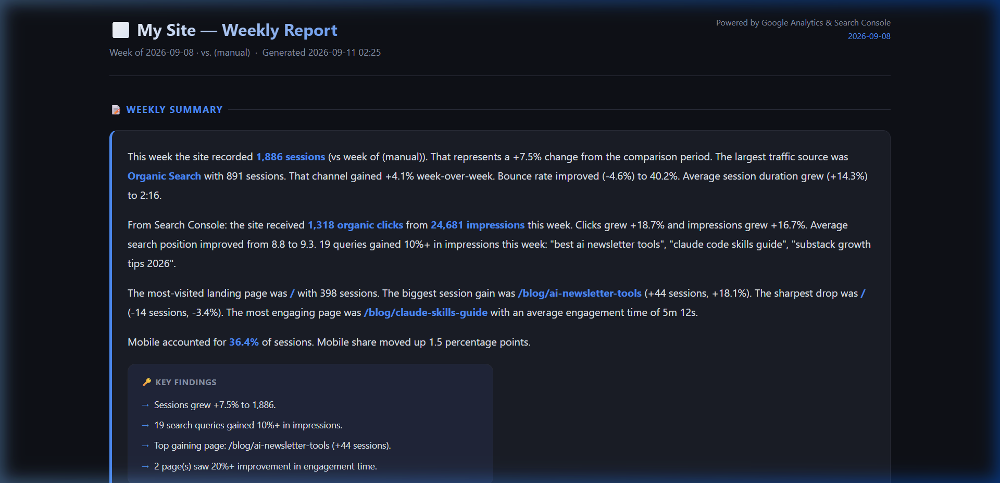
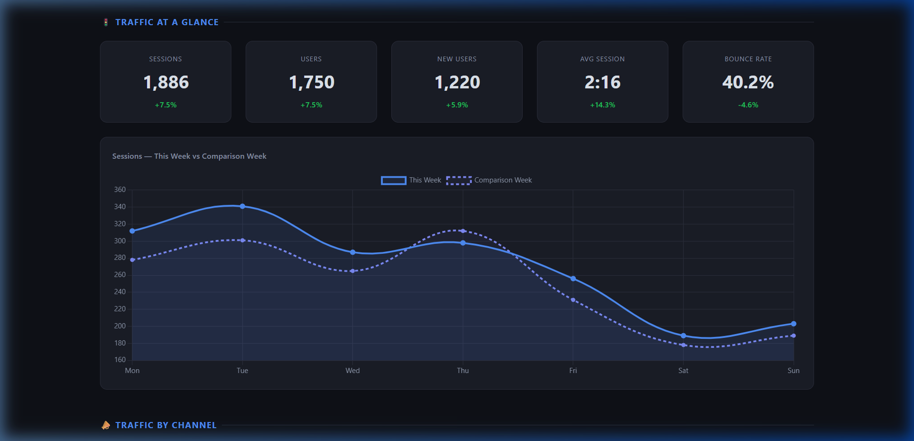
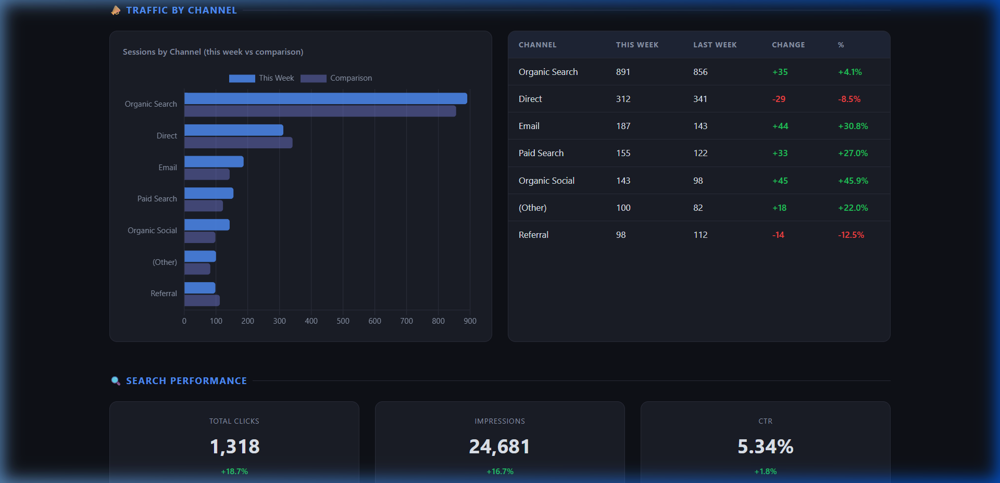
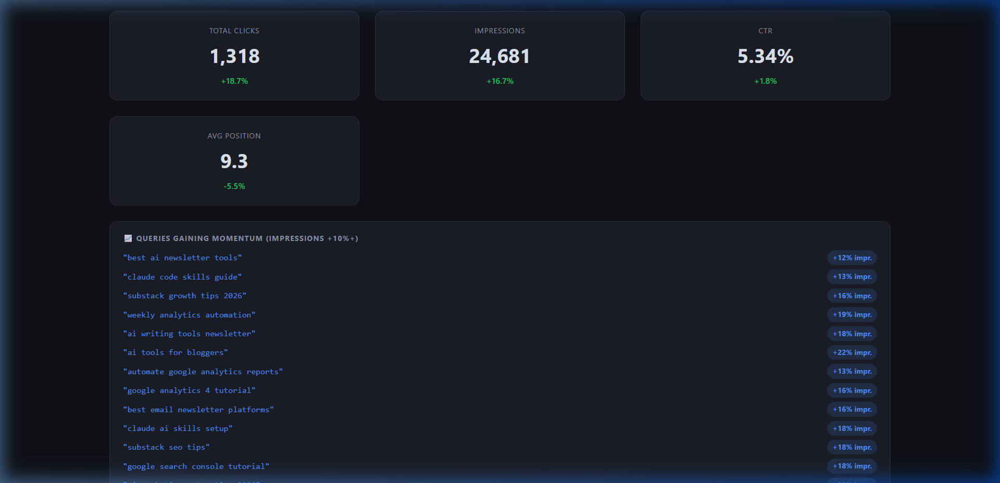
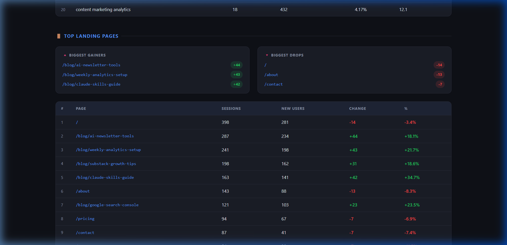
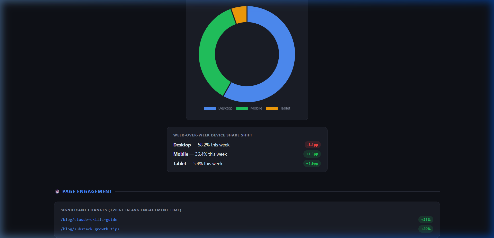

# We Collapsed 2 Hours of Weekly Analytics Admin into One Monday Artifact

> *"Whenever I'm stuck on whether to automate something, I ask one question: is this repetitive, or is this a decision? Repetitive gets automated. Decisions stay mine."*  
> — **Idea to Impact**

A production-ready **Claude Skill** that turns 6 scheduled Google Analytics 4 & Search Console CSV emails into an interactive, self-contained **HTML Artifact report**.

No Zapier. No n8n. No monthly SaaS dashboard subscriptions. Just free native scheduled emails, a Claude Skill, and an interactive dashboard that reveals what actually moved in your business.

---

## 📸 The Result: What the Generated Artifact Looks Like

When you drop your 6 Monday CSV files into Claude and type `/weekly-analytics-report`, here is the interactive dashboard Claude generates in under 30 seconds:

### 1. Executive Summary & Key Findings Callouts
Claude extracts the real story behind headline numbers (e.g. why overall traffic dipped while search intent surged) and highlights key momentum drivers:


### 2. Traffic at a Glance & Daily Trend
Interactive KPI cards with week-over-week deltas alongside a Chart.js daily session comparison line chart:


### 3. Acquisition Channels Breakdown
Horizontal bar chart comparing this week vs. prior week across Organic Search, Direct, Email, Paid, and Social:


### 4. Search Console Performance & Momentum Queries
Surfaces queries gaining +10% or more in impressions, tracks average position, and calculates weighted rankings:


### 5. Top Landing Pages & Engagement Shifts
Ranks pages by sessions, flags top gainers vs. sharpest drops, and identifies pages with significant engagement changes:


### 6. Device Split & Reading Depth
Donut chart showing desktop vs. mobile share shift, plus pages with +20% engagement increases:


---

## 🎯 What We Did vs. What Result It Achieved

| The Old Way (Manual Overhead) | What We Did (The AI Workflow) | The Result Achieved |
|:---|:---|:---|
| **45–90 minutes every Monday** opening 6 GA4 tabs, exporting CSVs, and cross-referencing tabs. | Automated ingestion and parsing using a dedicated **Claude Skill** (`weekly-analytics-report`). | **Turned 90 minutes into a 30-second drag-and-drop routine.** |
| **$50–$150/month SaaS dashboards** (Databox, AgencyAnalytics) showing noisy vanity charts. | Used free, native GA4 scheduled emails + Claude Artifacts with Chart.js. | **$600–$1,800/year saved** in software subscriptions with zero vendor lock-in. |
| **Misleading headline panic**: Seeing an 11% traffic drop and cutting ad spend. | Claude cross-references channels: reveals that search clicks grew +18% and engagement rose +20%. | **Protects strategic judgment** by separating temporary channel dips from core growth. |
| **Lost data history**: Downloaded spreadsheets get buried in Downloads or Gmail. | Archives raw CSVs + reports into dated historical folders (`~/analytics-reports/YYYY-MM-DD/`). | **Builds a compounding multi-week history** for long-term trend comparison. |

---

## 🧠 The Philosophy: Repetitive vs. Decision

Most founders get trapped in one of two extremes:
1. **Ignoring analytics altogether** because opening 6 spreadsheets feels like starting a research project from scratch.
2. **Paying for bloated automation platforms** (n8n, Make) that break every time Google changes an export format.

Here is the split that makes this work:
- **Repetitive (Automated by Claude)**: Skipping GA4 metadata pre-headers, parsing numbers, computing percentage deltas, weighting search positions, ranking top landing pages, and generating charts.
- **Decision (Kept by the Founder)**: Deciding which underperforming landing page to rewrite, which breakout search query (+10% impressions) to target next, and what content to double down on.

---

## 🛠️ The 6 Core Reports We Track

Instead of drowning in GA4's infinite menus, this setup tracks 5 essential questions:

| # | Report | The Question It Answers | Key Metrics Extracted |
|---|--------|-------------------------|------------------------|
| 1 | **Traffic Overview** | Did traffic change, and did the quality move with it? | Sessions, Users, Bounce Rate, Avg Duration |
| 2 | **Channel Grouping** | Which acquisition channel explains the movement? | Organic Search, Direct, Email, Social, Referral |
| 3 | **Landing Pages** | Which specific pages brought in new readers? | Page path, Sessions, New Users |
| 4 | **Search Queries** | What are people searching for, and what's gaining momentum? | Query, Clicks, Impressions, CTR, Position |
| 5 | **Device Breakdown** | Is the audience shifting between desktop and mobile? | Device Category, Sessions, % Share shift |
| 6 | **Page Engagement** | Are visitors actually reading, or bouncing immediately? | Page path, Average Engagement Time |

> **Graceful Degradation**: If Google Analytics only delivers 3 or 4 files, the skill automatically switches to *General Movement* mode rather than crashing.

---

## ⚠️ The 4 "Quiet Failure" Traps We Diagnosed & Solved

In automation, the most dangerous failures aren't error messages—they are the quiet bugs that fail silently. Here are the 4 gotchas we engineered around:

1. **The GA4 Floating Metadata Trap**:
   GA4 scheduled CSVs don't place headers on line 1. They begin with `# Date Range: ...` and variable metadata rows. Standard CSV parsers crash or misread columns. Our skill dynamically scans rows until it matches the exact report signature.
2. **The Zero-Division Arithmetic Crash**:
   Week-over-week formulas (`(Current - Prior) / Prior`) crash when prior week data is 0 or when a new page appears. The skill enforces fallback defaults (`+100%` or `N/A`) so calculations remain mathematically sound.
3. **The Average Position Distortion**:
   A plain average of search positions is dangerously misleading: rank 5 on a query with 2 impressions shouldn't outweigh rank 8 on a query with 5,000 impressions. The skill calculates **weighted average position**:
   $$\text{Weighted Position} = \frac{\sum(\text{Clicks} \times \text{Position})}{\sum\text{Clicks}}$$
4. **Missing Report Resilience**:
   If an email arrives with only 3 CSVs instead of 6, the skill doesn't error out. It logs the missing files, adjusts the layout, and renders a *General Movement* report with available data.

---

## 🚀 How to Set This Up in Your Claude Web (Same-Day)

### Step 1: Add the Skill to Claude Web (2 minutes)

1. Open [Claude.ai](https://claude.ai) and go to **Projects** > **New Project** (`Weekly Analytics`).
2. Click **Set Project Instructions** and paste the entire contents of [`SKILL.md`](./SKILL.md).
3. Under **Project Knowledge**, upload:
   - [`resources/report-template.html`](./resources/report-template.html) (HTML template)
   - [`references/csv-column-reference.md`](./references/csv-column-reference.md) (schema reference)
   - [`references/metrics-reference.md`](./references/metrics-reference.md) (formula reference)
4. Click **Save**.

### Step 2: Schedule the 6 GA4 Emails (One-Time Setup, 10 minutes)

Follow our step-by-step click guide in [`references/report-setup-guide.md`](./references/report-setup-guide.md) to configure Google Analytics to email you the 6 CSV reports automatically every Monday morning.

### Step 3: Run Every Monday (30 seconds)

1. Download the 6 CSV attachments from your Monday email.
2. Drag and drop them into your Claude Project chat.
3. Type:
   ```text
   /weekly-analytics-report
   ```
4. Claude reads the data, runs the calculations, and opens the interactive **HTML Artifact** dashboard directly on your screen.

---

## 📁 Repository Structure

```text
NL/
├── SKILL.md                          # The core Claude Skill instructions & prompt
├── README.md                         # This teardown and implementation guide
├── assets/                           # Screenshots of the generated Artifact dashboard
│   ├── header-summary.png
│   ├── traffic-glance.png
│   ├── channels.png
│   ├── search-performance.png
│   ├── landing-pages.png
│   └── devices-engagement.png
├── evals/
│   └── evals.json                    # Standardized evaluation test cases
├── references/
│   ├── report-setup-guide.md         # Exact clicks to schedule the 6 GA4 reports
│   ├── csv-column-reference.md       # Exact GA4/GSC column headers & dimensions
│   └── metrics-reference.md          # Pure mathematical formulas for all metrics
├── resources/
│   └── report-template.html          # Self-contained dark-mode dashboard template (Chart.js)
└── examples/
    ├── current_week/                 # 6 realistic sample CSVs for immediate testing
    ├── previous_week/                # 6 prior week CSVs for WoW comparison
    └── example-report.html           # Rendered example HTML Artifact dashboard
```

---

## 🧪 Testing with the Included Sample Data

You don't need to wait until Monday to verify that it works. Drag the 6 sample files from [`examples/current_week/`](./examples/current_week) into your Claude chat right now to preview your interactive dashboard. You can also view the pre-rendered [`examples/example-report.html`](./examples/example-report.html).
